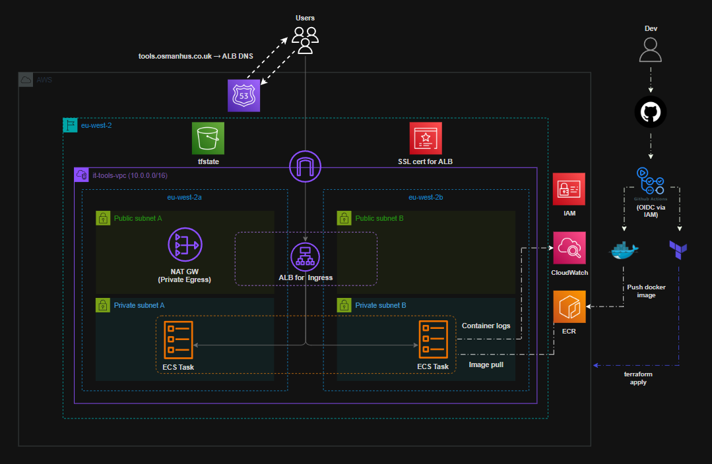
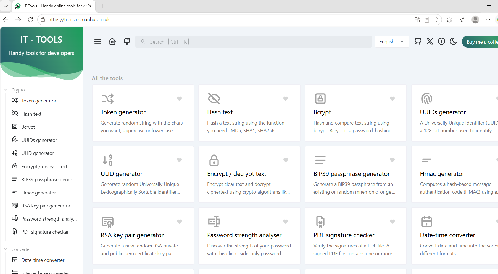
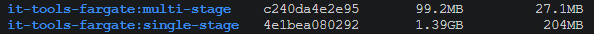
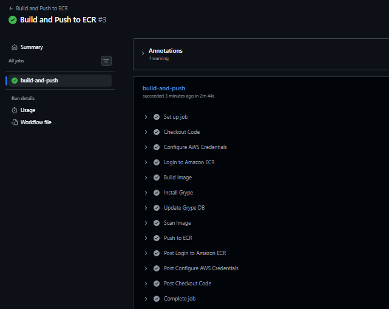
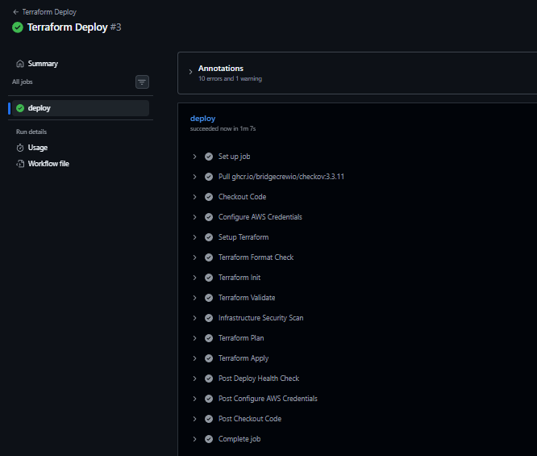
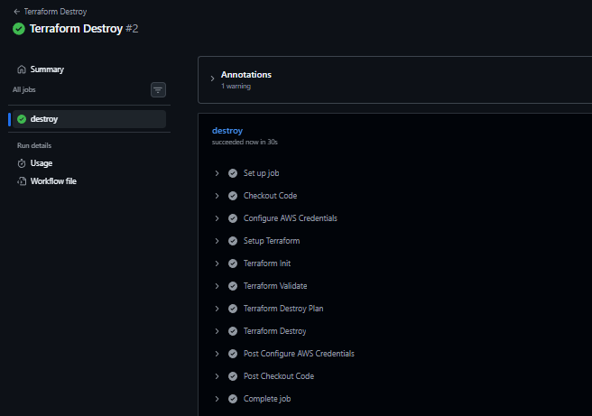

# IT Tools Platform on AWS (ECS Fargate, Terraform, CI/CD)


<p align="center">
  
</p>

---

## Table of Contents

- [Overview](#overview)
- [Application URL](#application-url)
- [Architecture Overview](#architecture-overview)
- [Features](#features)
- [Repository Structure](#repository-structure)
- [Key Components](#key-components)
- [Cost & Availability Decisions](#cost--availability-decisions)
- [CI/CD Pipelines](#cicd-pipelines)
- [Getting Started](#getting-started)
- [Lessons Learned](#lessons-learned)
- [Future Improvements](#future-improvements)
  
## Overview

A production-style container platform built on AWS ECS Fargate, deploying IT Tools through a secure Multi-AZ architecture with public and private subnets. Designed to provide a scalable and repeatable deployment environment, with application traffic routed through an Application Load Balancer and secured using Route 53 and ACM-managed HTTPS.

Infrastructure is provisioned through Terraform with remote state and native locking in Amazon S3, while GitHub Actions automates container builds, security scanning, and infrastructure deployment. Docker images are stored in Amazon ECR and deployed to ECS tasks running within private subnets, with CloudWatch providing centralised logging. AWS OIDC enables secure CI/CD authentication without long-lived credentials, creating an automated delivery workflow from source code through to production infrastructure.

---

## Application URL
→ https://tools.osmanhus.co.uk



---

## Architecture Overview

The platform runs in a custom VPC spanning two Availability Zones and follows standard AWS reference architectures used in real deployments:

- Public subnets hosting an Application Load Balancer (multi-AZ) and a standard zonal NAT Gateway
- Private subnets running ECS Fargate tasks
- HTTPS and HTTP redirect enforced using ACM and Route 53
- Container images stored and managed through **Amazon ECR**
- Centralised logging via CloudWatch
- Provisioned and managed through Terraform

---

## Features
- Infrastructure provisioned using **Terraform**
- Remote Terraform state stored in **Amazon S3 Bucket**
- Custom **VPC** with two Public and Private Subnets spanning Multiple Availability Zones
- Container image build, vulnerability scanning, and storage using **Amazon ECR**
- **ECS Fargate Service** behind ALB and HTTPS enabled using **AWS Certificate Manager (ACM)**
- Custom Domain configured using **Route 53**
- Automated Container image build/push and deployment using **GitHub Actions**
- **GitHub Actions** authentication using **AWS OIDC** (no long-lived AWS credentials)

---

## Repository Structure
```
.
├── .github/
│   └── workflows/
│       ├── build.yml
│       ├── deploy.yml
│       └── destroy.yml
├── app/
│   ├── Dockerfile
│   ├── nginx.conf
│   └── app source code
│
├── bootstrap/
│   ├── main.tf
│   ├── outputs.tf
│   ├── provider.tf
│   └── variables.tf
│
├── infra/
│   ├── main.tf
│   ├── outputs.tf
│   ├── provider.tf
│   ├── variables.tf
│   └── modules/
│       ├── acm/
│       ├── alb/
│       ├── ecs/
│       └── vpc/
├── assets/
│   ├── build-and-push.png
│   ├── docker-image-comparison.png
│   ├── live-application.png
│   ├── terraform-deploy.png
│   └── terraform-destroy.png
├── .gitignore
└── README.md
```

---

## Key Components

### Containers & Runtime

- Multi-stage Docker build reduced the application image from **1.39 GB → 99.2 MB (~93%)**
- Container runs as a **non-root user**, reducing unnecessary runtime privileges
- Application runs as an **ECS Fargate service** across two Availability Zones
- ECS tasks run exclusively within private subnets with `assign_public_ip = false`
- Container images are stored in **Amazon ECR** and versioned using immutable Git SHA tags



> [!NOTE]
> ECS Fargate was selected to provide managed container compute without provisioning or maintaining EC2 worker instances.

### Networking & Ingress

- Custom `10.0.0.0/16` VPC spans `eu-west-2a` and `eu-west-2b`
- Public subnets host the internet-facing **Application Load Balancer** and NAT Gateway
- Private subnets isolate **ECS Fargate tasks** from direct internet access
- ECS security rules permit application traffic only from the ALB security group
- NAT Gateway provides controlled outbound connectivity for workloads in private subnets
- HTTP traffic is redirected to HTTPS before being forwarded to healthy ECS targets

> [!NOTE]
> Keeping ECS tasks private ensures the ALB remains the only public entry point to the application.

### DNS & TLS

- **Route 53** manages DNS for `tools.osmanhus.co.uk`
- **AWS Certificate Manager (ACM)** provides the TLS certificate used by the ALB
- Route 53 directs application traffic to the internet-facing ALB
- DNS for the application subdomain is delegated from Cloudflare to Route 53

### Terraform & State Management

- Infrastructure is provisioned through reusable **Terraform modules** for VPC, ALB, ACM, and ECS
- Remote Terraform state is stored in **Amazon S3**
- Native S3 state locking with `use_lockfile = true` prevents concurrent state modifications
- Infrastructure parameters are exposed through variables to reduce hard-coded configuration
- Terraform formatting, validation, planning, and security checks run before deployment

> [!IMPORTANT]
> Remote state and state locking protect the shared Terraform state from conflicting infrastructure changes.

### Security

- **GitHub Actions OIDC** provides temporary AWS credentials without long-lived access keys
- IAM permissions are scoped to the operations required by GitHub Actions and ECS
- ECS tasks run without public IP addresses inside private subnets
- Container vulnerability scanning runs before images are published to ECR
- Terraform security scanning checks infrastructure configuration before deployment

### Observability

- ECS container logs are centralised in **Amazon CloudWatch Logs**
- Log retention is explicitly configured through Terraform
- ECS deployment circuit breaker automatically rolls back failed deployments
- Post-deployment health checks verify application availability after infrastructure changes
  
---

## Cost & Availability Decisions

- **ECS Fargate** avoids the operational overhead of provisioning and maintaining dedicated EC2 container hosts
- Two Availability Zones provide workload distribution and improved application availability
- A single NAT Gateway is used to reduce development costs while maintaining private-subnet outbound connectivity
- CloudWatch log retention is explicitly configured to prevent indefinite log storage
- Infrastructure can be removed through the Terraform Destroy workflow when the environment is no longer required

> [!NOTE]
> A single NAT Gateway reduces cost for this project but introduces an Availability Zone dependency. A production environment could deploy one NAT Gateway per AZ for greater resilience.

---

## CI/CD Pipelines

This project uses three GitHub Actions workflows with clear separation of responsibility.

### 1) Build and Push to ECR

- Runs on push to main when `app/**` changes
- Builds and scans the container image for vulnerabilities
- Authenticates to AWS via OIDC and pushes the image to ECR
- Uses Git SHA tags for immutable container image versioning

> [!IMPORTANT]
> GitHub Actions authenticates to AWS using **OIDC and temporary credentials**, eliminating the need to store long-lived AWS access keys.




### 2) Deploy and Post Health Check



### 3) Destroy Infrastructure


---

## Getting Started

#### Prerequisites: Docker installed on your machine.

#### 1. Clone the Repository

```bash
git clone https://github.com/huss-osman/it-tools-fargate-platform.git
cd it-tools-fargate-platform
```

#### 2. Build and Start the Container

```bash
docker build -t it-tools ./app
docker run -d --name it-tools --restart unless-stopped -p 8080:80 it-tools
```

#### 3. Access the Application

Open your browser and visit:

```bash
http://localhost:8080
```

#### 4. Stop the Application

```bash
docker stop it-tools
docker rm it-tools
```

---

## Lessons Learned
- **GitHub OIDC Authentication** - Initially, I considered using AWS access keys within my GitHub Actions. After researching authentication methods, I implemented OIDC instead, allowing the workflow to assume an IAM role using temporary credentials generated at runtime. This eliminates the need to store long-lived AWS credentials within GitHub, significantly reducing the risk of credential exposure.

- **IAM Permissions** - While testing my Terraform Destroy workflow, the pipeline failed because the GitHub Actions role was missing the `iam:ListInstanceProfilesForRole` permission. Troubleshooting the 403 AccessDenied error and updating the IAM policy helped me understand the importance of ensuring least-privilege permissions cover both infrastructure deployment and resource teardown.

- **Route 53 DNS Delegation** - My domain was already managed through Cloudflare, while I wanted the application DNS managed through Amazon Route 53. I delegated the `tools.osmanhus.co.uk` subdomain using NS records in Cloudflare, allowing Route 53 to manage the application record and ACM certificate validation without transferring management of the entire domain.

---

## Future Improvements

Potential improvements to further mature the platform include:

- Introduce ECS Auto Scaling based on `CPU` and `memory` utilisation to improve application scalability
- Add separate `dev` and `prod` environments with controlled promotion between stages
- Implement `AWS WAF` in front of the ALB to strengthen application-layer security
- Extend observability with `CloudWatch` alarms and dashboards for application and infrastructure monitoring
